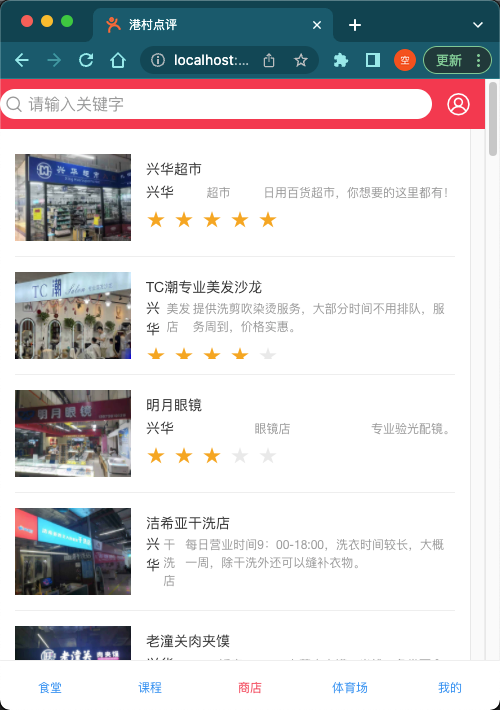
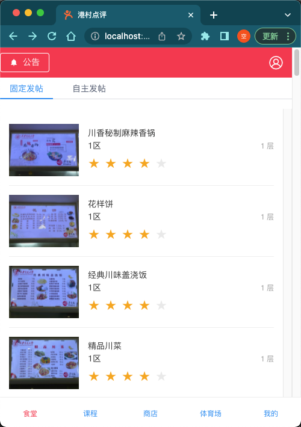
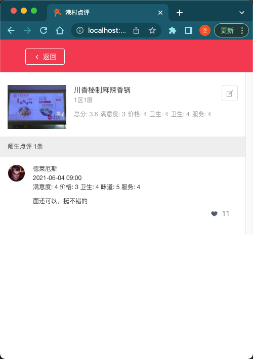

# 港存点评-前端

#### 介绍

“港村点评”是西安交通大学创新港校区的校园点评平台（课程项目），各位校友、游客均可浏览食堂、课程、体院场馆、兴华/道科四个分区内
的各个评分项目并参与评分，还可发表帖子、发表评论。

#### 软件架构

flask + vue.js + mysql

#### 项目小组
七嘴八舌7

商店点评



食堂点评




评价浏览点评




浏览点评内容


运行

```shell
npm run dev
```
